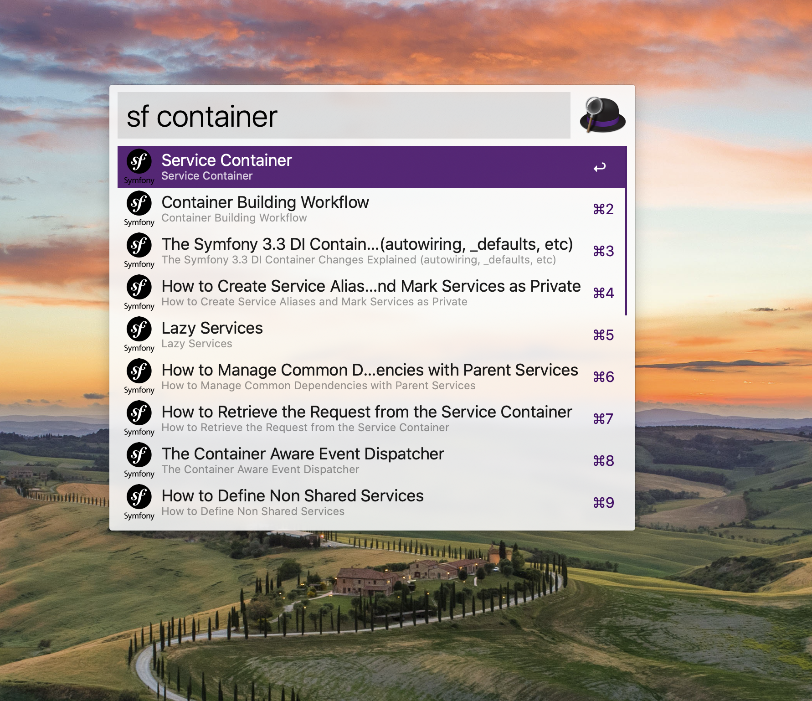

# Symfony Docs Workflow for Alfred

An Symfony docs search workflow for Alfred 3.

Adapted from [Alfred Laravel Docs](https://github.com/tillkruss/alfred-laravel-docs), Thanks [Till Krüss](https://twitter.com/tillkruss)
and [VueJS Docs Workflow for Alfred](https://github.com/vmitchell85/alfred-vuejs-docs), Thanks [Vince Mitchell](http://www.vincemitchell.me)!


## Installation

1. [Download the latest version](https://github.com/ThomasTr/Alfred-Symfony-Docs/releases/latest/download/Symfony-Docs.alfredworkflow)
2. Install the workflow by double-clicking the `.alfredworkflow` file
3. You can add the workflow to a category, then click "Import" to finish importing. You'll now see the workflow listed in the left sidebar of your Workflows preferences pane.

## Usage

```
vue <query>
```

Just type `sf` followed by your search query.
